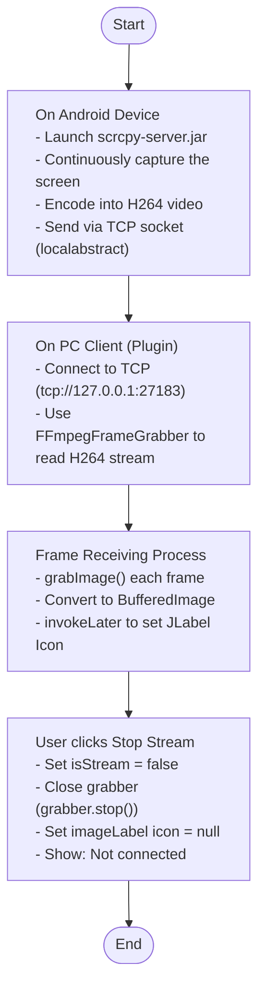

# IUG Plugin

**IUG Plugin** Interactive User Guide(IUG) is a feature which helps users learn how to use Galaxy AI features in a step by step manner.

---

## 🪐 Login
We use WebView to open `https://samsungu.udemy.com/organization/home`

User can login on that screen then plugin we save property login status

Currently, SRV can not run with login flow (network block or something wrong). So we comment them to build and run successfully

Please check `TODO can not run on SRV`, uncomment those related lines and try again

---

## ✨ Log
### Features

- Custom Log for real-time logging
- Supports log levels
- Tag-based logging (like Android's `Log.d(TAG, message)`)
- Filter logs (by level, tag)
- Copy logs to clipboard
- Clear logs
- Adb connection status realtime
  - **use AndroidDebugBridge on ddmlib to register listen device change**

### How to Use

Use the `Log` class to log messages from anywhere in this plugin

## 📡 Screen information
Show screen id and package name on realtime

- How to get Screen Id and Package name currently? (2 way)

  - command: adb shell dumpsys activity activities
    - Filter by `topResumedActivity=ActivityRecord`

  - command: `adb logcat ActivityTaskManager:I \*:S`
    - Filter by `ActivityRecord` or `Displayed`
    - Create infinity loop to update information realtime
    

- **Apply** button use to update package name in Common info

---

## 🌌 Screen Mirror

Document: https://github.com/Genymobile/scrcpy/blob/master/doc/develop.md

## 📈 RuleMaker Graph Panel

### Technologies Used
- **JGraphX (mxGraph)**: A robust Java library for graph visualization and editing.

### Features
- **Node Representation**: Each node represents a step in a rule, which can be categorized as either a main step or a sub-step.
- **Edge Connections**: Edges illustrate the connections between steps, providing a clear view of the workflow.
- **Automatic Layout Adjustment**: The layout logic ensures that main steps are arranged horizontally, while sub-steps are positioned vertically relative to their parent nodes. The graph automatically adjusts to keep all nodes visible and neatly organized.

### Usage
#### Context Menu Actions
- **Edit Step**: Modify node information in the step info panel and click **save**.
- **Add Sub-Step**: Right-click on a main step and select **"Add Sub-Step"** to create a sub-node.
- **Add Next Step**: Right-click on a main step and select **"Add Next Step"** to add a sequential node.
- **Remove Step**: Right-click on a node and select **"Remove Step"** (this option is only enabled if the node has no children).
- **Swap Node**: Right-click on a node and select **"Swap Node"** to exchange it with another node by ID.

#### UI Interactions
- **Select Node**: Left-click a node to select it.
- **Open Context Menu**: Right-click a node to access the context menu with available actions.

### Extending the Project
The codebase is modularized for maintainability:
- **GraphPanel**: The main UI component that handles user interactions and delegates layout logic.
- **GraphPanelLayoutUtils**: A utility object for graph layout and node positioning, allowing for a clean and easily extendable codebase.
